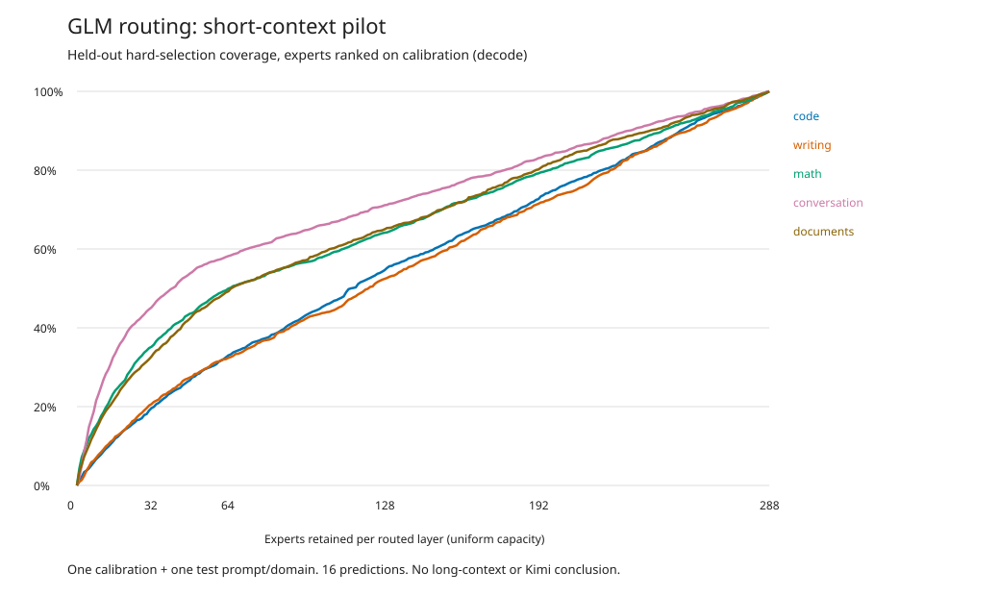

# GLM-5.3-Flash: first measured EWS routing curves

**Status: locally executed short-context pilot, 14 September 2026.**
Ten workloads completed across five domains, with a separate tracing-off/on
control. This validates the instrument on real GLM execution; it does **not**
establish a deployment hotset size or classify GLM as Gemma-like or Mixtral-like.

[Machine-readable receipt](data/glm53-routing-20260914.json) ·
[Raw evidence ZIP](data/glm53-routing-20260914.zip) ·
[Protocol and instrumentation](../RUNTIME_AUTH_ROUTING_RECOVERY.md)

## The result

The first control produced **2,478,080 bit-identical float32 logits** with
tracing off and on, maximum absolute difference **0**. Both complete logit
tensors are in the archive, not just their hashes. All ten traced cases
reconcile per-expert hits/misses and phase callbacks with the actual EWS totals
across **42 routed layers, 288 experts per layer and top-8 selections**.

The following are **generation-phase** results on each held-out prompt:

| Domain | Actual EWS hits, 8 slots/layer | Selection coverage at 64 experts/layer, ranked on calibration |
|---|---:|---:|
| Code | 32.92% | 33.25% |
| Writing | 34.76% | 32.58% |
| Math | 27.20% | 50.18% |
| General conversation | 24.23% | 58.37% |
| Document review | 32.36% | 49.94% |

These are different quantities: the first column measures the real dynamic
8-slot cache. The second evaluates a fixed expert ranking learned from the
calibration prompt, without choosing experts using the test prompt.
64 experts per layer represent **41,217,425,408 bytes of expert weights alone**
in this artifact, before non-expert weights, KV, buffers or other applications.

The optimistic, in-sample ranking reaches 90% of selections with 43-52 experts
per layer on these short test outputs. That is **not** the demonstrated held-out
coverage: selecting a hotset after seeing the test is an oracle. Most experts
are unseen in a single short calibration prompt; their ties are resolved by ID.
This pilot primarily demonstrates how easily an in-sample concentration claim
can overstate the usefulness of a fixed hotset. It does not show that a richer
calibration corpus or an online cache cannot work.

Prefill and decode counters, per-layer rankings, first-access counts and full
reuse-distance distributions are retained in the archive. The derived serial-LRU
curves are theoretical empty-request-start cache curves, not exact EWS predictions:
EWS protects the current top-k during eviction. Actual hits remain separately measured.

## Conditions

- Windows laptop, Intel Core i9-14900HX, 34,070,192,128 bytes physical RAM;
  RTX 4090 Laptop GPU, 16,376 MiB reported VRAM, NVIDIA driver 595.79.
- GLM-5.3-Flash UD-Q4_K_XL, six shards, model revision
  `621d456e93e926e4b52f85cff5f634358c1828f9`. Existing model provenance is
  included; all 199.7 GB were **not rehashed** for this campaign.
- Existing experimental runtime `b9b8207fcfc2962093b9466df7af4ff29c2a81ef`
  with the GLM EWS patch. Runtime DLL hashes are frozen in the manifest.
- Hybrid placement, `gpu_layers=20`, 8 physical slots per routed layer,
  18 routed layers on CUDA and 24 on CPU; KV F16/F16, context capacity 512,
  one-token batches, 8 CPU threads, greedy argmax, 16 predictions per item.
- Five domains, one calibration and one test prompt each, defined **before
  inference** in [the workload file](../../tests/routing_workloads_v1.json).
  These are short **raw completions**, not chat-template prompts or Next sessions.
- Each item starts a fresh process with empty EWS/KV caches. OS cache state is
  not flushed. Next is not running and there is no resident cohabitation test here.
- The eleven forward processes took 607.994 seconds in total. Concurrent source
  compilation and uncontrolled cache state make this **unsuitable for an
  instrumentation overhead or throughput claim**. The first off/on process
  times were 44.97/44.81 seconds, one pair only.
- No generated EOG token occurs among the retained 16 predictions in these ten
  items. The numerical probe evaluates a fixed prediction count, not a full answer.

Probe executable SHA-256:
`fdd534781fb7a3afe8e15e9f17a0a4a3159e88db7bf40e334a42f3dbdbeac131`.
Workload SHA-256:
`8dbd113fdb6c819c41f57f404d8833821ef950485d3a4b0b1cd954c4a7aed12e`.
Raw archive SHA-256:
`1eef379f7c9a6f12582b7204e3273c3d381317542deab4d19320ce0727808e1e`.

The archive includes per-item stdout/stderr, raw routing JSON, original prompts,
settings, timings, analysis, file hashes and the full off/on logit pair. The
remaining logit tensors are retained locally, with their hashes in the archive.
In this first archive, `model-provenance.json` is a reformatted JSON copy; its
archive file hash is distinct from the original source-file digest recorded in
the campaign manifest. Model revision and shard hashes are unchanged. The runner
now retains the original receipt bytes for subsequent campaigns.
The measured probe was built during this source change; its exact binary hash
and linked-runtime hashes identify the measured artifact, not an older release.

## Actual backend integration, separately checked

`routing-backend --trace-smoke FIRST_SHARD.gguf 8` exercises the real EIE
`CpuBackend` with GLM and hybrid GPU experts. It passes:

1. Traced chat with complete outcome and counters reconciled against EWS.
2. Untraced chat with identical text/token count and the old histogram cleared.
3. Context overflow retaining an explicit error outcome.
4. Output callback cancellation retaining an explicit cancelled outcome.
5. Subsequent successful chat and a complete new trace.

Its raw stdout/stderr are included. This checks the production backend path,
not Next's application lifecycle or a fleet of concurrent clients.

## What still needs measuring

This is a first instrument check, **not** the original large-context P0 campaign.
Next: pre-freeze a substantially larger, multi-prompt corpus; separate calibration
and held-out test; measure 1k/4k/16k/64k contexts, domain shifts and repeated runs;
then measure real Next sessions and matched tracing overhead. Retain divergent
results rather than pooling them into one reassuring average.

No Kimi conclusion follows from this GLM run. Its routing distribution must be
measured on its own artifact with the same validated instrument.
